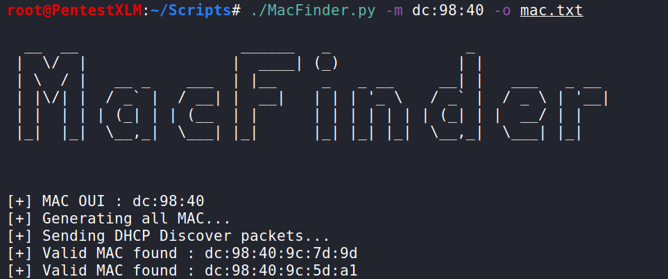
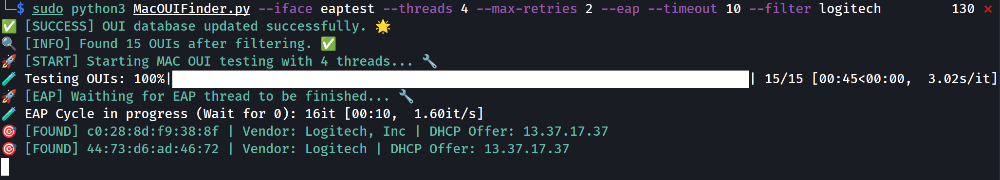

# MacFinder
A tool used to bypass MAC based NAC

# MacOUIFinder

A tool to search whitelisted OUI MAC address on NAC.

For example, if a Logitech OUI is whitelisted on the client network, that tool should find it after testing all the OUI (or juste the Logitech OUI).
For that, DHCP request with a MAC address composed of the OUI to test for the first half and a random part of the second half was send.
If a DHCP offer came back, a valid OUI was found.

## EAP

In some case, the NAC try to enforce the usage of a certificate by sending some EAP request identity and then fallback to a MAC whitelisting mode.
So, even if a MAC was whitelisted, the DHCP respond only after some EAP exchange.
In that case, the eap option could be set (with a time to wait between EAP sequences and a retry number) to try to get an IP.
That part was not tested in a real case, only in a lab with the dhcp-eap-sender.py script which simulate the behavior seen on a customer network.

## Usage

sudo python3 MacOUIFinder.py --iface eth0 --filter logitech

sudo python3 MacOUIFinder.py --iface eth0 --filter logitech --eap -eap-session-repeat 2 --eap-session-duration 70 --eap-debug

See the help for more options like the timeout
